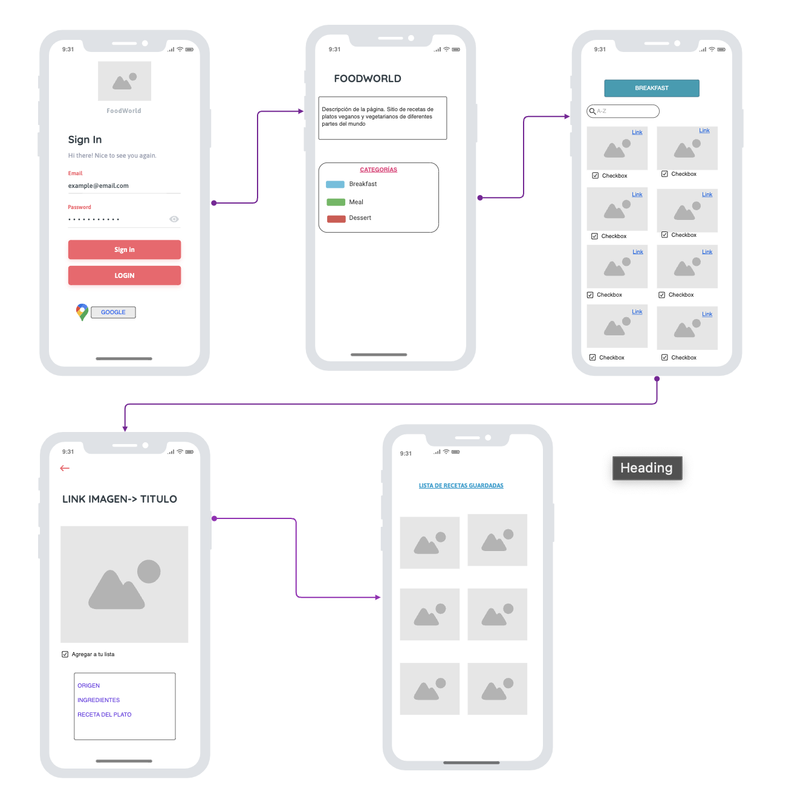

# FoodWorld - Vegan and Vegetarian Recipes Application

## Description

FoodWorld is a web application that allows you to explore a wide variety of vegan and vegetarian recipes from different countries. Although it is still in development, this application aims to provide lovers of vegan and vegetarian food with a platform to discover, search, and learn new delicious and healthy recipes.

# General Features

## Technologies Used

For the development of FoodWorld, the following technologies and APIs have been utilized:

- HTML
- CSS
- JavaScript (ES6)
- Dynamic DOM manipulation
- HTTP requests to APIs

## Functionality

The main functionalities that have been implemented and are under development include:

- Recipe search by name, ingredients, or country.
- Viewing recipe details, including ingredients, instructions, and origin.
- User authentication (In progress).
- Storing favorite recipes for registered users (In progress).
- Utilizing charts to display nutritional statistics of recipes (In progress).
- Integrating maps to locate nearby vegan and vegetarian restaurants (In progress).

## Deployment

The FoodWorld application is deployed on GitHub Pages. You can access it through the following URL:

## Points for Improvement

1. Complete Authentication: While I mention that authentication is under development, it's a significant area for improvement. Users should be able to create accounts, log in, and save their favorite recipes. This would enhance user interaction and provide a more personalized experience.

2. Data Storage: Currently, I mention the use of Firebase Firestore and Storage, but I haven't provided details on how they are utilized in the application. It would be beneficial to showcase examples of how recipe and user data is stored and retrieved from Firebase.

3. Charts and Maps: I'm working on integrating charts and maps, and it would be helpful to complete these functionalities. Charts can display nutritional statistics for recipes, and maps can assist in locating vegan and vegetarian restaurants.

# Project Management with Trello

I have used Trello as a project management tool to organize and plan the development of FoodWorld. Through Trello, I created a project board where I logged all the tasks, features, and functionalities planned for the project. Additionally, I have shared the initial web sketch to provide a clear vision of the site's structure and design.

## Initial Web Sketch

Below, I'm sharing the initial web sketch of the FoodWorld homepage:

This sketch serves as a guide for the application's structure and design. As we progress in development, we are working to transform this sketch into a fully functional web application.

## FoodWorld on GitHub Pages
